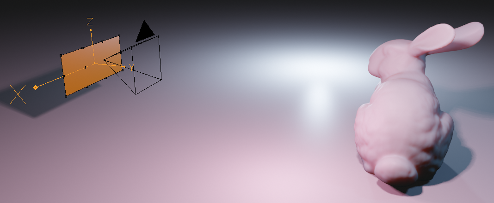
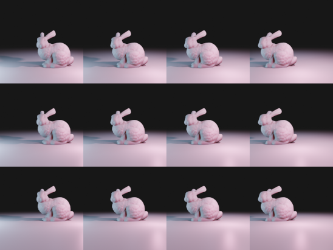
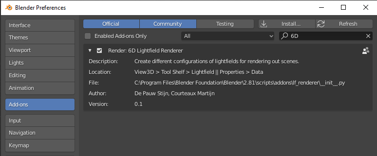
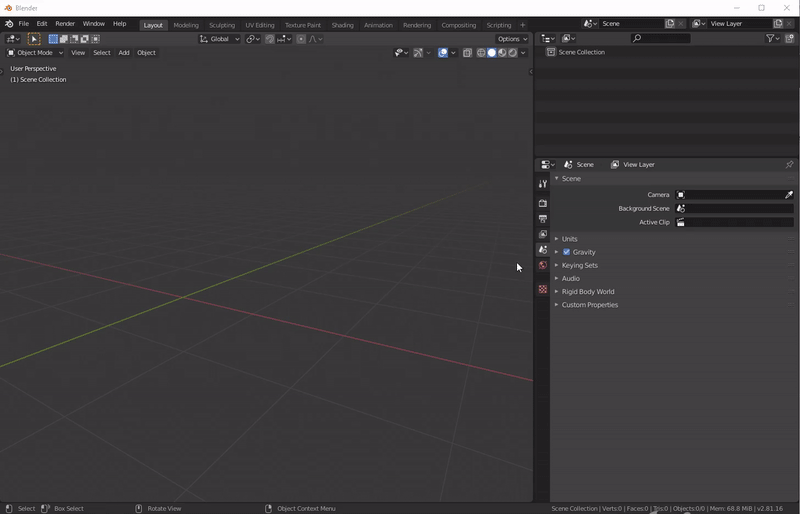
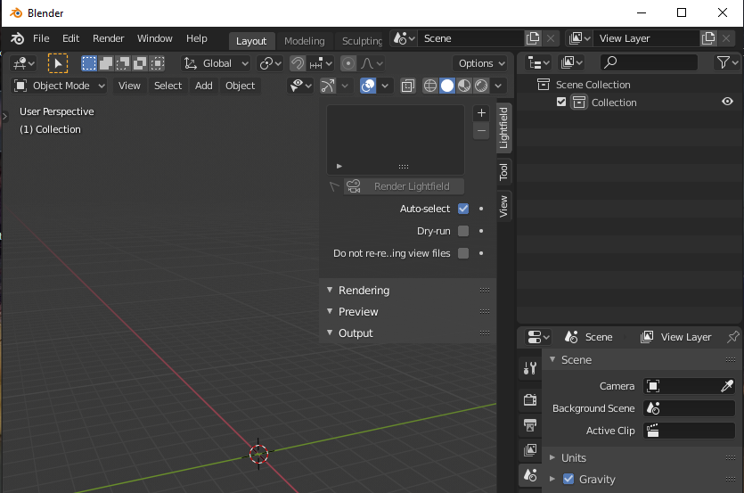
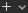
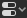
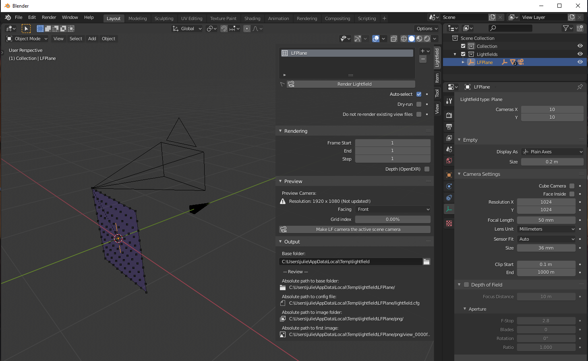

# Blender Addon for Light Field Rendering
 

 

This addon allows to **quickly create several multi-camera setups in Blender**. It automatically renders and saves the generated images (and depth information). The addon currently supports 4 basic multi-camera setup types, which can be combined to create large image datasets:

<p float="left">
  
  
  
  
</p>

- **Plane**: all cameras are positioned on a rectangular grid and rotated to look along the normal of the plane.
- **Cuboid**: the Plane setup is copied to the 6 faces of a cuboid.
- **Cylinder**: the Plane setup is wrapped around a cylinder.
- **Sphere**: each camera is positioned on a sphere and rotated to look along the normal of that sphere at its position. To get mostly evenly spaced cameras, the 3D positions of the vertices of an Icosphere are used.

## Requirements
Blender 2.80 or higher.

## Installation

First, identify where Blender is installed. If you download Blender straight from the website, chances are that it is sitting in a personal folder, like your downloads folder.
If you have Blender installed through some package manager or intaller wizard, it might be installed in system folders:
 - **Linux**: `/usr/share/blender/`
 - **Windows**: `C:\Program Files\Blender Foundation\Blender`

### Option 1: Clone into the Blender addon directory
The easiest way is to clone the repository directly into the Blender addon directory.
```sh
cd /path/to/blender/<version>/scripts/addons/
git clone https://github.com/IDLabMedia/blender-lightfield-addon.git
```
Here, the `/path/to/blender/` is where you have blender installed, like
described above. Additionally, `<version>` should be replaced by the version of
Blender you have, e.g.: `3.0`.

### Option 2: Download source files and move them manually into the addon directory.
 1. Download or clone this repository.
 2. Navigate to the directory in which Blender is installed, like described above.
 3. Then continue down to where the addons are stored:
   `./<version>/scripts/addons`.  (replace `<version>` with the version of your
   Blender installation, e.g.: `3.0`).
 4. Create a new directory and copy all python files from this repository to
   that new directory.

## Usage
Open Blender and go to `Edit > Preferences ... > Add-ons` and search for
"6D Lightfield Renderer". Make sure the addon is enabled by checking the
checkbox.





To start using the addon in Blender, open the 3D Viewport view and type `N` to open the right Sidebar. You will see a new tab there, called `Lightfield`. 



Clicking the  icon on the left of
that opens a dropdown that allows you to select the desired camera setup. The
options are: Lightfield Plane, Cuboid, Cylinder and Sphere. Selecting one
creates a default camera setup of the chosen type. The setup can be configured
in this Sidebar, as well as by going into the `Properties`  tab
that is by default already open on the right side of Blender and selecting the
`Object data properties` icon . 



Moving, rotating and scaling the camera setups can be done from the 3D
Viewport. Changing the number of cameras and the camera intrinsics (resolution,
focal length, etc.) is done in the `Object data properties` .

**Rendering**: in the right Sidebar of the 3D Viewport, under tab `Lightfield >
Output`, set the desired output path. Then start the rendering process by
pressing the `Render Lightfield` button at the top of the Sidebar. Blender will
now render one image for each camera in the setup and store them in the output
folder. 

**Image format**: by default, the output images are stored as PNG files. It is
possible to also store the depth maps by selecting the checkbox next to `Depth
(OpenEXR)` in the Sidebar. This will, for each camera, combine the output image
and depth into one `.exr` file, where the first 3 channels contain the (red,
green, blue) color data, and the fourth channel the depth (by default in
meters). The OpenEXR files contain 16-bit floating-point RGB and Depth. [This
means that the actual "bit depth" is 10-bit mantissa, with a 5-bit power value
and 1-bit
sign](https://docs.blender.org/manual/en/latest/files/media/image_formats.html#openexr).

**Camera config file**: by pressing the `Render Lightfield` button, a
`lightfield.json` (and a deprecated `lightfield.cfg`) file are created,
containing information about the camera intrinsics (lens type, projection type,
sensor width, resolution, etc.), the camera setup type (Plane, Cuboid,
Cylinder, Sphere), and the position and rotation of each camera according to
the Blender axial system (Z up, right-handed).

**Compositing**: this addon also works when Compositing nodes are used.

